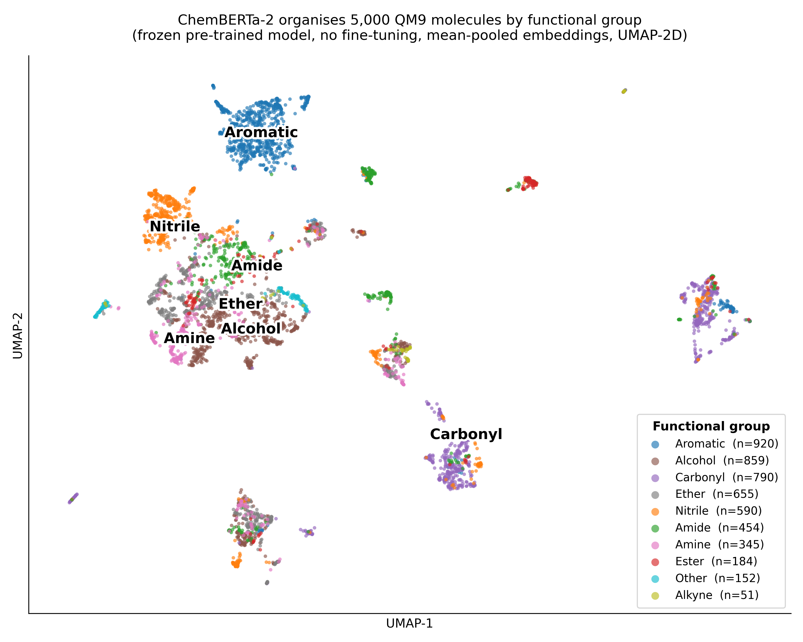

# SIMDeLL pilot — ChemBERTa-2 latent space on QM9

> Empirical 1-day pilot for the PhD audition (ED STIC Paris-Saclay, 29 May 2026).

## Motivation

The SIMDeLL thesis hypothesis: chemo-LLMs pre-trained on large molecular corpora (ChemBERTa, MolBERT, etc.) already encode a structured representation of chemical space, exploitable by lightweight adaptation (PEFT) rather than retraining from scratch. Current SOTA on spectrum-to-structure (Molecular Transformer IR, NMIRacle) trains from zero and ignores this prior. This pilot tests the hypothesis directly.

## Method

1. Sample 5,000 molecules from QM9 (`yairschiff/qm9`, seed=42)
2. Encode SMILES with `DeepChem/ChemBERTa-77M-MTR` (frozen, no fine-tuning), mean-pooling on non-padding tokens
3. Project the 384-dim embeddings to 2D with UMAP (`n_neighbors=15`, `min_dist=0.1`)
4. Color by chemical properties (heavy-atom count, ring count, functional group, MW)
5. Compute silhouette score on discrete coloring
6. (Optional) compare to UMAP on Morgan fingerprints (radius 2, 2048 bits) as baseline

## Result



## Conclusion

*One sentence to fill in after the run.*

## Repro

```bash
pip install -r requirements.txt
python pilot_chemberta_qm9.py
```

Runs in ~1–2 h on CPU, ~20–40 min on GPU. All seeds fixed (numpy, torch, UMAP).

## Caveats

- ChemBERTa's tokenizer has known bugs on bracketed atoms (`[Cl+2]`) and chirality (decoded SMILES are not always identical to input). For QM9 (uncharged CNOF molecules), this is not an issue.
- Pilot is rhetorical: the figure must read in 5 seconds. The silhouette score is a Q&A backstop, not the headline.

## Refs

- ChemBERTa-2: Ahmad et al. (2022), arXiv:2209.01712 — checkpoint `DeepChem/ChemBERTa-77M-MTR` on HF
- QM9: Ramakrishnan et al. (2014), *Sci. Data* — HF mirror `yairschiff/qm9` (134k molecules, parquet)
- UMAP: McInnes et al. (2018), arXiv:1802.03426
